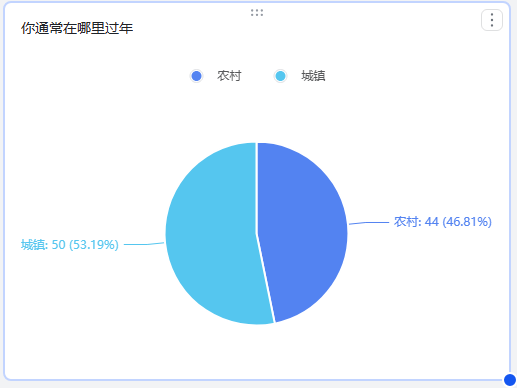
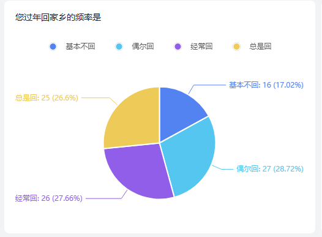
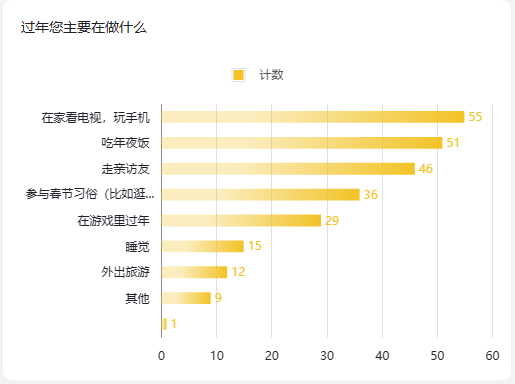
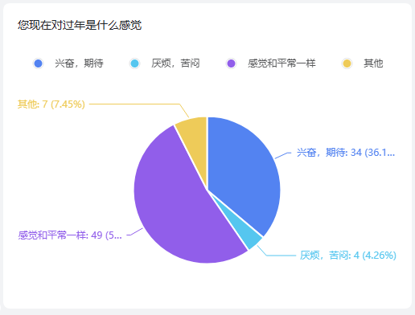
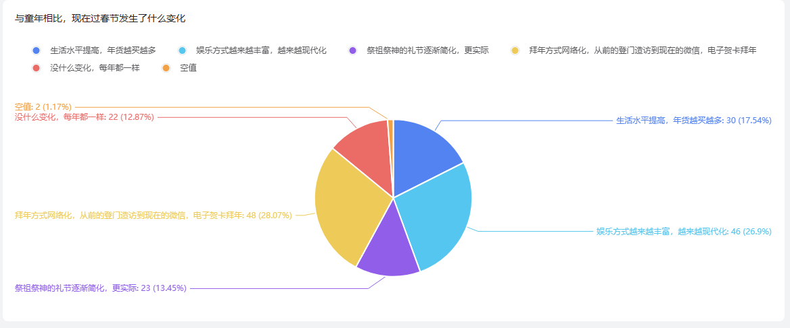
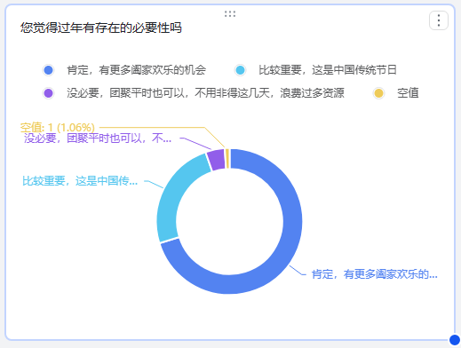
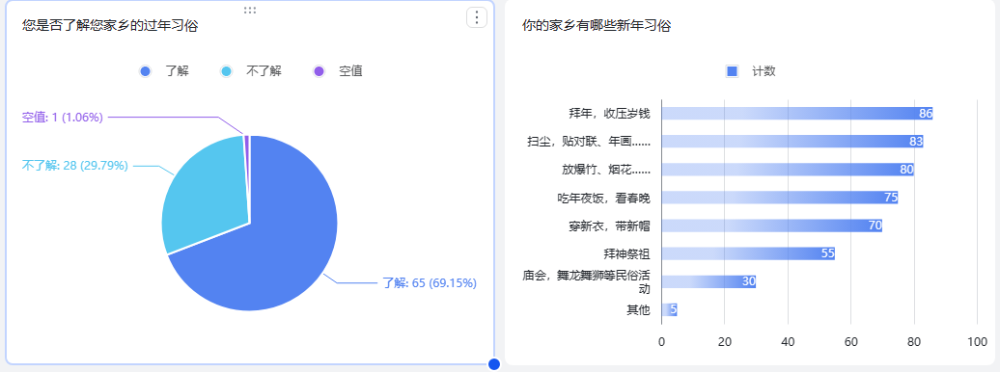
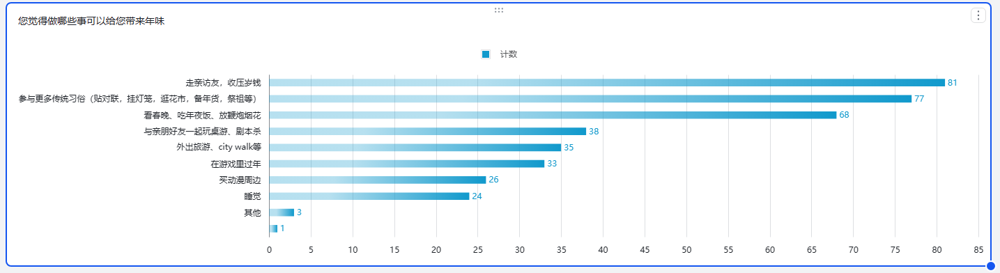
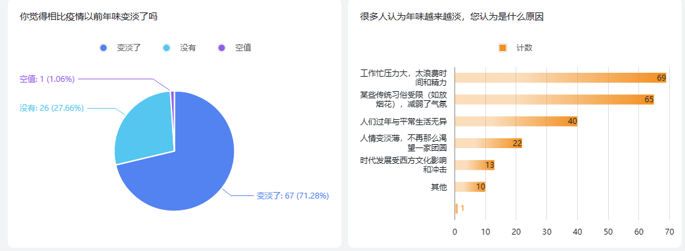
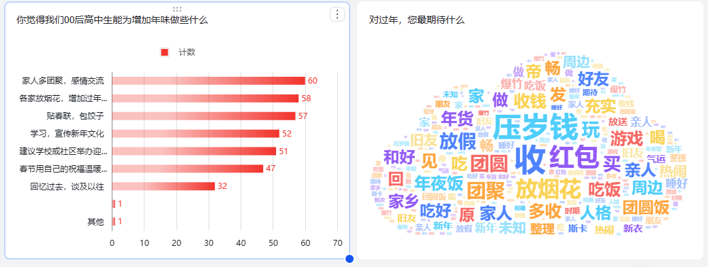

[原始问卷](https://acmeteam.feishu.cn/share/base/form/shrcn3p3spUWi24O50thmQB1whf)
[原始数据](https://acmeteam.feishu.cn/base/PvkvbtzStap5xusr23HcZOejnBc?from=from_copylink)
[原始问卷分析](https://acmeteam.feishu.cn/share/base/dashboard/shrcnCCYQXqKh15rt9I3gEil4Kf)

